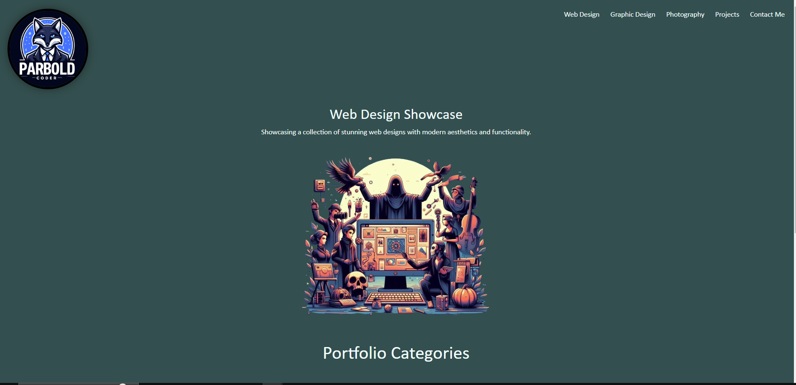

# Bootstrap-Portfolio

## Description
Expanding on the portfolio I introduced Bootstrap to the page to allow for flexibility. on smaller screens and devices.  I also included some of my own art and design to give it more creative touch.

 

## Application Image

 
 
## Application URLs
https://github.com/ParboldCoder/Bootstrap-Portfolio
 
https://parboldcoder.github.io/Bootstrap-Portfolio/
 
## Author
Darren Buck
https://github.com/ParboldCoder